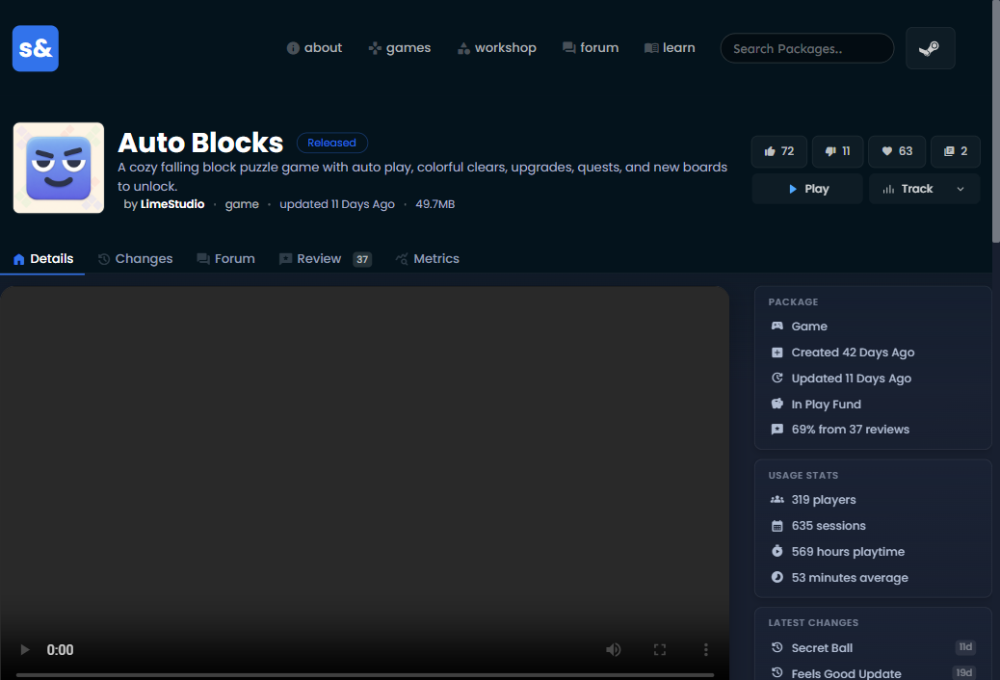

<p align="center">
  
</p>

<h1 align="center">s&box Enhanced</h1>

<p align="center">
  A small browser extension that makes game pages on <a href="https://sbox.game">sbox.game</a> a bit more useful.
</p>

<p align="center">
  <a href="https://addons.mozilla.org/en-US/firefox/addon/sbox-enhanced/"></a>
  &nbsp;
  <a href="https://chromewebstore.google.com/detail/sbox-enhanced/aojojkghcmnlanmgpckdpefcjkjnpmpn"></a>
</p>



## What it does

s&box Enhanced adds two buttons underneath the usual package actions:

- **Play** opens the game directly in s&box through Steam.
- **Track** lets you open the game on [s&box watch](https://sbox.watch) or [s&boxDB](https://sboxdb.dev).

Creator stats pages also gain local export tools:

- **Overview** exports every aggregate stat as JSON or CSV.
- **Aggregated** exports all matching players across every page, with LastSeen presets and an exact date range.
- **Entries** stays disabled because raw event tables can contain tens of thousands of rows, and links back to Aggregated instead.

It works on the main game page as well as Changes, Forum, Reviews, and Metrics pages. It stays out of the way on maps, models, materials, and other package types.

## Install it locally

Use Node.js 24 and pnpm 11.7.0, then install and build both browser targets:

```powershell
pnpm install --frozen-lockfile
pnpm build
```

### Chromium

Open `chrome://extensions`, enable **Developer mode**, click **Load unpacked**, and select:

```text
build/chrome-mv3-prod
```

Chrome, Edge, Brave, and other Chromium browsers should all work. Steam needs to be installed and registered to handle `steam://` links. Your browser may ask for confirmation before opening it.

### Firefox

Firefox 140 or newer is supported on desktop. Open `about:debugging#/runtime/this-firefox`, click **Load Temporary Add-on**, and select:

```text
build/firefox-mv3-prod/manifest.json
```

A temporary add-on is removed when Firefox restarts. Persistent Firefox installations need an AMO-signed package.

## Development

Start Plasmo for the browser you are testing:

```powershell
pnpm dev:chrome
pnpm dev:firefox
```

Load `build/chrome-mv3-dev` from the Chromium extensions page or `build/firefox-mv3-dev/manifest.json` from Firefox's **This Firefox** debugging page. Plasmo will rebuild the selected target while you work.

Before opening a pull request, run:

```powershell
pnpm check
```

Individual commands are also available:

```powershell
pnpm lint
pnpm lint:firefox
pnpm typecheck
pnpm test
pnpm build
pnpm package
```

`pnpm build` and `pnpm package` cover both Chromium and Firefox. Browser-specific commands are also available as `build:chrome`, `build:firefox`, `package:chrome`, and `package:firefox`.

## Adding another tracker

Trackers live in [`lib/trackers.ts`](lib/trackers.ts). Adding one only takes an icon, a registry entry, and a URL test.

1. Put the site's official icon in `assets/trackers/`.
2. Import it with Plasmo's `data-base64:` prefix.
3. Add a `TrackerDefinition` to `TRACKERS`.
4. Add the expected URL to `tests/trackers.test.ts`.

URL templates can use `{organization}` and `{game}`:

```ts
{
  id: "example",
  label: "Example Tracker",
  icon: exampleIcon,
  urlTemplate: "https://tracker.example/games/{organization}/{game}"
}
```

## Permissions and privacy

The extension only runs on `https://sbox.game/*` and requests no extension API permissions. It does not collect data, run analytics, use browser storage, upload exported stats, or fetch tracker icons at runtime. Firefox builds explicitly declare `data_collection_permissions.required: ["none"]`.

Tracker, project, and creator pages only open after you click one of their links. See the full [privacy policy](PRIVACY.md).

## Credits

- [s&box watch](https://sbox.watch) and [s&boxDB](https://sboxdb.dev) for the tracking sites and their icons.
- [LimeStudio](https://sbox.game/limestudio) for the LimeStudio logo used in the popup.
- [Plasmo](https://www.plasmo.com) for the extension framework.

s&box, Steam, and the other names and logos used here belong to their respective owners. This project is not affiliated with or endorsed by Facepunch, Valve, s&box watch, or s&boxDB.
