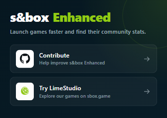

<p align="center">
  
</p>

<h1 align="center">s&box Enhanced</h1>

<p align="center">
  A small browser extension that makes game pages on <a href="https://sbox.game">sbox.game</a> a bit more useful.
</p>


## What it does

s&box Enhanced adds two buttons underneath the usual package actions:

- **Play** opens the game directly in s&box through Steam.
- **Track** lets you open the game on [s&box watch](https://sbox.watch) or [s&boxDB](https://sboxdb.dev).

It works on the main game page as well as Changes, Forum, Reviews, and Metrics pages. It stays out of the way on maps, models, materials, and other package types.

Clicking the extension icon also gives you quick links to the project and [LimeStudio](https://sbox.game/limestudio).

<p align="center">
  
</p>

## Install it locally

For now, build the extension from source:

```powershell
pnpm install
pnpm build
```

Then open `chrome://extensions`, enable **Developer mode**, click **Load unpacked**, and select:

```text
build/chrome-mv3-prod
```

Chrome, Edge, Brave, and other Chromium browsers should all work. Steam needs to be installed and registered to handle `steam://` links. Your browser may ask for confirmation before opening it.

## Development

Start Plasmo in development mode:

```powershell
pnpm dev
```

Load `build/chrome-mv3-dev` from the extensions page. Plasmo will rebuild the extension while you work.

Before opening a pull request, run:

```powershell
pnpm check
```

Individual commands are also available:

```powershell
pnpm lint
pnpm typecheck
pnpm test
pnpm build
pnpm package
```

## Adding another tracker

Trackers live in [`lib/trackers.ts`](lib/trackers.ts). Adding one only takes an icon, a registry entry, and a URL test.

1. Put the site's official icon in `assets/trackers/`.
2. Import it with Plasmo's `data-base64:` prefix.
3. Add a `TrackerDefinition` to `TRACKERS`.
4. Add the expected URL to `tests/trackers.test.ts`.

URL templates can use `{organization}` and `{game}`:

```ts
{
  id: "example",
  label: "Example Tracker",
  icon: exampleIcon,
  urlTemplate: "https://tracker.example/games/{organization}/{game}"
}
```

## Permissions and privacy

The extension only runs on `https://sbox.game/*`. It does not collect data, run analytics, use browser storage, or fetch tracker icons at runtime.

Tracker pages only open after you click one of their links.

## Credits

- [s&box watch](https://sbox.watch) and [s&boxDB](https://sboxdb.dev) for the tracking sites and their icons.
- [LimeStudio](https://sbox.game/limestudio) for the LimeStudio logo used in the popup.
- [Plasmo](https://www.plasmo.com) for the extension framework.

s&box, Steam, and the other names and logos used here belong to their respective owners. This project is not affiliated with or endorsed by Facepunch, Valve, s&box watch, or s&boxDB.
